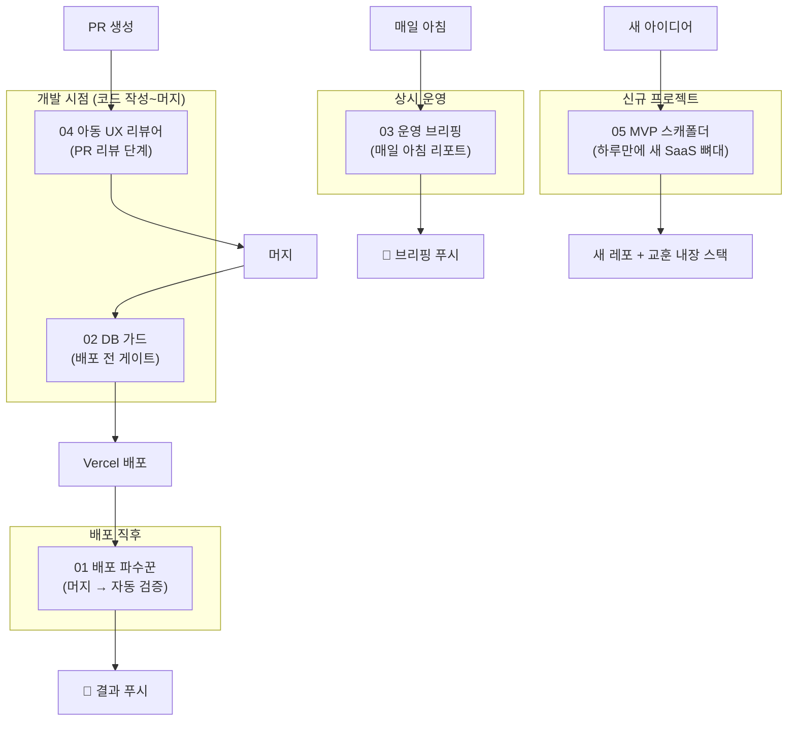

# dev-agents — 1인 개발 워크플로용 AI 에이전트 설계 구상도

> ⚠️ **임시 위치**: 현재 SORI 레포의 `agents-blueprint/`에 있으며, 추후 별도 레포(`cheojang/dev-agents`)로
> 이 폴더를 통째로 이동할 예정 (자기완결 구조라 폴더째 옮기면 됨).
> 실제 동작하는 에이전트 정의는 이 레포의 `.claude/agents/`와 `.claude/skills/`에 설치되어 있음 —
> 레포 분리 후에도 `.claude/` 쪽 사본은 SORI에 남긴다 (여기서 동작해야 하므로).

> cheojang의 실제 개발 세션(바른발음 sori-care.com 운영·개선)과 레포 11개의 작업 패턴을 분석해 도출한,
> **반복 병목을 제거하는 에이전트 5종**의 설계 문서 모음.

## 왜 이 5종인가 — 관찰된 병목

| # | 반복된 병목 | 실제 사례 (바른발음 세션) | 담당 에이전트 |
|---|-------------|---------------------------|----------------|
| 1 | 머지 후 "배포 됐나?" 수동 폴링 + 손 QA 왕복 | 배포 유실(#130)을 1시간 뒤에야 발견, 매번 curl 폴링 | **01 배포 파수꾼** |
| 2 | 코드는 배포됐는데 DB/인프라가 미반영 | UserConsent 테이블, screenshotUrl 컬럼, images 버킷 — 3회 발생 | **02 DB 가드** |
| 3 | 운영 상태를 보려면 직접 들어가야 함 | 후기 심사(2일 내 거절 필요), 에러 로그, 결제 현황 | **03 운영 브리핑** |
| 4 | 아동 UX 결함을 배포 후 실사용에서 발견 | 그림 없는 변별 게임, 정답이 먼저 재생돼 답 유출 | **04 아동 UX 리뷰어** |
| 5 | 새 아이디어마다 같은 스택을 재세팅 + 같은 함정 재답습 | 레포 11개 대부분 Next+Supabase 초기화 반복 | **05 MVP 스캐폴더** |
| 6 | "고쳤다" 보고 후 재발 — 같은 버그를 2~3회 수정 | 문장 소리 잔류(3회 수정), 스키마 드리프트 재발 | **06 헤르메스 (자가검증·자가개선)** |
| 7 | 모든 작업을 같은 모델로 — 기계적 일에도 최고가 모델 | 폴링·스모크·대량 배치에 상위 모델 사용 | **07 모델 라우터 (Opus/Sonnet/Haiku 분배)** |

## 전체 아키텍처



## 우선순위 로드맵

| 단계 | 에이전트 | 예상 효과 | 구현 난이도 |
|------|----------|-----------|-------------|
| 1주차 | 01 배포 파수꾼 | 머지→검증 왕복 시간 소멸, 배포 유실 즉시 감지 | 낮음 (Routine + 스모크 스크립트) |
| 1주차 | 02 DB 가드 | "프로덕션에 컬럼 없음" 유형 사고 0건화 | 낮음 (검사 스크립트 1개) |
| 2주차 | 03 운영 브리핑 | 관리자 페이지 안 봐도 운영 파악, 심사 기한 놓침 방지 | 중간 (API 집계 + 크론) |
| 3주차 | 04 아동 UX 리뷰어 | 배포 후 UX 재수정 감소 | 중간 (리뷰 프롬프트 튜닝) |
| 필요 시 | 05 MVP 스캐폴더 | 새 앱 첫 커밋까지 반나절 | 중간 (템플릿 정리) |
| 상시 | 06 헤르메스 | 수정 반복 횟수 감소, 교훈 재발 방지 | 낮음 (/retro 스킬 + 지식 파일) |
| 상시 | 07 모델 라우터 | 대량 배치·상시 에이전트 비용 수 배 절감 | 낮음 (frontmatter model 필드) |

## 문서 구성

```
docs/00-work-style.md          업무 스타일 진단 (설계의 근거)
docs/99-integration-map.md     바른발음 등 기존 프로젝트와의 연결 지점
agents/01~05/README.md         에이전트별 상세 설계 (목적·트리거·흐름도·구현·안전장치)
claude/agents/*.md             Claude Code에 바로 넣는 서브에이전트 정의
agents/06-hermes/              자가검증·자가개선 (헤르메스) 설계
agents/07-model-router/        업무 강도별 모델 분배 (Opus/Sonnet/Haiku)
knowledge/lessons.md           축적된 교훈 (헤르메스가 관리, 30줄 상한)
knowledge/patterns.md          실패 패턴 사전 (증상→원인→검증법)
claude/skills/*/SKILL.md       Claude Code 스킬 정의 (db-guard, retro)
```

## 공통 설계 원칙

1. **폰 우선 보고** — 모든 에이전트의 최종 출력은 "폰에서 읽는 3~7줄 요약 + 필요 시 링크". 데스크톱 없이 지시·확인하는 워크플로에 맞춤.
2. **자동 실행, 수동 승인** — 읽기/검증/보고는 전자동. 프로덕션 변경(DB 쓰기, 강제 배포)은 반드시 사람 확인 후.
3. **실패는 조용히 넘기지 않기** — 검사 불능(로그 접근 실패 등)도 "검사 못 했음"으로 보고. 침묵=정상 아님.
4. **기존 인프라 재사용** — Vercel 크론, CRON_SECRET, 관리자 게이트(isAdmin), 웹푸시 등 바른발음에 이미 있는 것 위에 얹는다.
5. **자가검증** — "고쳤다" 보고 전 증상 재현 시나리오 통과가 기준. 검증 못 했으면 그렇게 말한다. (06 헤르메스 루프 A)
6. **판단 밀도에 맞는 모델** — 기계적 실행은 Haiku, 표준 구현은 Sonnet, 원인 미상·설계·메타 판단은 Opus. (07 분배표)
