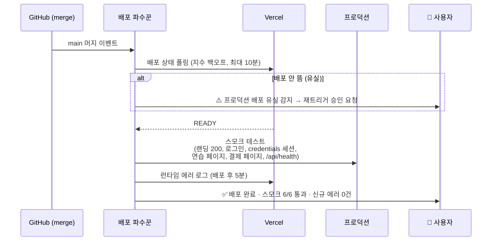

# 01 배포 파수꾼 (Deploy Sentinel)

> 머지하는 순간부터 "프로덕션이 정말 멀쩡한지"까지를 사람 대신 지켜보고, 결과만 폰으로 보고한다.

## 해결하는 병목
- 머지 후 배포 완료를 curl 폴링으로 수동 확인하던 왕복 (세션에서 수십 회 반복)
- **배포 유실 미인지**: PR #130이 프리뷰만 빌드되고 프로덕션 배포가 누락된 것을 1시간 뒤에야 발견
- 배포는 됐지만 런타임에서 죽는 경우(커넥션 고갈 "시스템 오류")를 사용자 제보로야 인지

## 트리거
- main 브랜치 머지 (PR merged 웹훅 / CCR PR 구독)
- 수동: "방금 배포 확인해줘"

## 입력 → 출력
- 입력: 머지 커밋 SHA, 변경 파일 목록
- 출력(푸시 알림, 3~7줄):
  - ✅/❌ 배포 상태 + 소요 시간
  - 스모크 테스트 결과 (핵심 플로우 N개)
  - 신규 런타임 에러 유무 (배포 전후 로그 비교)
  - ❌일 때: 원인 1줄 진단 + "롤백할까요?" 선택지

## 동작 흐름

## 스모크 테스트 목록 (바른발음 기준)
| # | 검사 | 방법 |
|---|------|------|
| 1 | 랜딩/로그인/구독 페이지 200 | HTTP 상태 |
| 2 | credentials 로그인 → 세션 발급 | 테스트 계정(admin2) 실로그인 |
| 3 | 대시보드 SSR에 에러 바운더리 문구 없음 | HTML 본문 검사 |
| 4 | /api/health (DB 연결) | 응답 코드 |
| 5 | TTS 캐시 응답 | /api/tts?word=사과 |
| 6 | 배포 전 대비 신규 5xx 없음 | Vercel 로그 diff |

## 구현 방법 (Claude Code 위)
1. **1단계 (반나절)**: CCR Routine "머지 후 배포 검증" — 세션에서 쓰던 폴링+curl 스모크를 스크립트화(`scripts/smoke.sh`), 결과를 푸시 알림으로.
2. **2단계**: PR 활동 구독(subscribe_pr_activity)으로 머지 이벤트에 자동 반응.
3. **3단계**: 실패 시 자동 진단 서브에이전트 호출 — Vercel 로그 digest → 원인 후보 요약 → 롤백/재배포 선택지 제시.

## 안전장치
- 자동으로 하는 것: 조회·검증·보고, 배포 유실 시 **재트리거 제안**까지만
- 사람 승인 필요: 롤백, 강제 재배포, 환경변수 변경
- 스모크 테스트 계정은 무료 등급 테스트 계정만 사용 (프로덕션 데이터 오염 방지 — 검증 후 흔적 정리)
