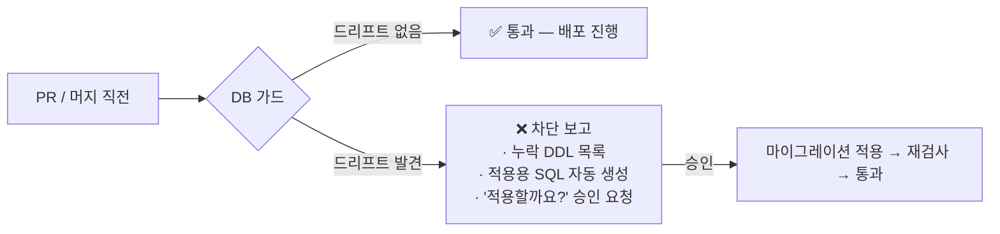

# 02 DB 가드 (Schema Drift Guard)

> "코드는 배포됐는데 DB에는 그 컬럼이 없다"를 배포 **전에** 잡는 게이트.

## 해결하는 병목
바른발음에서 **3회 반복**된 동일 유형 사고:
1. `UserConsent` 테이블 미생성 → 동의 체크 실패
2. `ReviewBonus.screenshotUrl` 컬럼 미반영 → 후기 페이지 전체가 503
3. Storage `images` 버킷 미존재 → 캡처본 업로드 전면 불가 (기능 출시 후 발견)

근본 원인: 스키마 변경(prisma.schema)과 프로덕션 DDL 적용이 **분리된 수동 작업**이라 잊힌다.

## 트리거
- PR 생성/머지 전 (CI 스텝 또는 커밋 전 스킬)
- 수동: "/db-guard" — 지금 프로덕션과 스키마 대조

## 검사 항목
| 검사 | 방법 |
|------|------|
| ① prisma.schema ↔ 프로덕션 스키마 diff | `prisma migrate diff --from-url $PROD --to-schema-datamodel` (읽기 전용) |
| ② 코드가 참조하는 Storage 버킷 존재 | 코드 grep(`storage.from("...")`) ↔ `storage.buckets` 조회 |
| ③ 코드가 참조하는 환경변수 존재 | `process.env.X` grep ↔ Vercel env 목록 (값은 안 봄, 키만) |
| ④ 크론 경로 ↔ vercel.json 등록 일치 | 파일 존재 대조 |

## 동작 흐름



## 출력 예시 (푸시 알림)
```
❌ DB 가드: 드리프트 2건
· ReviewBonus.rejectSeenAt 컬럼이 프로덕션에 없음
· 코드가 참조하는 버킷 "images" 미존재
→ 적용 SQL 준비됨. "적용해"라고 답하면 실행합니다.
```

## 구현 방법
1. **1단계 (2시간)**: `scripts/db-guard.ts` — ①~④ 검사를 모아 exit code로 반환. 로컬/CI 어디서든 실행.
2. **2단계**: 배포 파수꾼(01) 앞단에 연결 — 머지 감지 시 스모크 전에 가드 먼저.
3. **3단계**: 드리프트 발견 시 적용 SQL 자동 생성 + 승인 후 실행 (Supabase MCP 또는 보호된 마이그레이션 엔드포인트).

## 안전장치
- 프로덕션 DB에는 기본 **읽기 전용** (information_schema 조회만)
- DDL 실행은 반드시 사람 승인 + 실행 SQL 전문을 사전 표시
- `DROP`/`ALTER ... DROP` 계열은 자동 생성 대상에서 제외 (추가·완화만 자동 제안)
