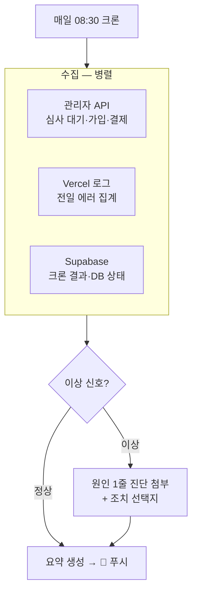

# 03 운영 브리핑 (Ops Briefing)

> 관리자 페이지에 들어가지 않아도, 매일 아침 운영 상태가 폰으로 온다.

## 해결하는 병목
- 후기 심사는 **2일 내에 거절하지 않으면 자동 승인** — 안 들어가면 기한을 놓침
- 에러(커넥션 고갈 등)를 사용자 제보로야 인지
- 가입/결제/사용량을 보려면 관리자 페이지·Vercel·Supabase 3곳을 돌아야 함

## 트리거
- 매일 아침 08:30 KST (크론)
- 수동: "오늘 운영 상황 브리핑해줘"
- 긴급 조건부: 에러 급증 시 즉시 발송 (임계치: 시간당 5xx N건)

## 브리핑 구성 (폰 한 화면)
```
🌤 바른발음 아침 브리핑 (7/12)
━━━━━━━━━━━━━━━━━━
✍️ 후기 심사 대기 2건 (⏰ 1건은 오늘 14시 자동승인)
👥 신규 가입 3 · 활성 세션 41 · 결제 1건(4,900원)
🚨 어제 에러: 0건  ·  크론 2/2 정상
📊 연습 세션 87회 (전일 대비 +12%)
→ 심사하러 가기: sori-care.com/admin/reviews
```

## 동작 흐름



## 구현 방법
1. **1단계**: 집계 API `/api/admin/briefing` (isAdmin 게이트) — 심사 대기 수·마감 임박·가입·결제·세션 수를 한 번에 반환.
2. **2단계**: CCR Routine(매일 아침) — 위 API + Vercel 로그를 읽고 요약을 푸시. 판단이 필요한 부분(이상 신호 진단)만 LLM.
3. **3단계**: 긴급 브리핑 — 배포 파수꾼(01)과 임계치 공유, 에러 급증 시 아침을 기다리지 않고 발송.

## 안전장치
- 읽기 전용 에이전트 — 어떤 상태도 변경하지 않음 (심사 승인/거절은 링크로 사람이)
- 개인정보 최소화: 브리핑에는 집계 숫자만, 개별 사용자 식별정보 미포함
- 수집 실패 항목은 "수집 실패"로 명시 (침묵 금지)
