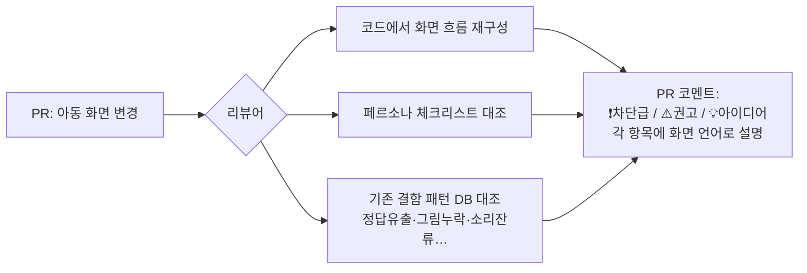

# 04 아동 UX 리뷰어 (Kid-UX Reviewer)

> "글 모르는 4세 + 폰을 쥔 부모" 페르소나로 PR을 리뷰하는 전문 리뷰어.
> 일반 코드 리뷰가 못 잡는 **사용성 결함**을 배포 전에 잡는다.

## 해결하는 병목
배포 후 실사용에서야 발견된 아동 UX 결함들 (모두 코드상 "버그"가 아니라 리뷰어 관점의 문제):
- 변별 게임에 **그림 없는 단어**가 출제됨 — 글 모르는 아이는 정답 기준 자체가 없음
- 정답 소리가 **항상 먼저 재생**돼 답이 유출됨
- 소리 버튼 탭 = 즉시 판정이라 **두 소리를 비교해 들을 수 없음**
- 음절 재생이 너무 느림 / 재생 중인 버튼이 어딘지 표시 없음

## 트리거
- 아동 대면 화면(연습·게임·아동 컴포넌트) 변경이 포함된 PR
- 수동: "/kid-ux 이 화면 리뷰해줘" (+스크린샷)

## 리뷰 체크리스트 (페르소나 2종)

**👶 4세 아이 (글 못 읽음, 소리·그림으로만 이해)**
- [ ] 텍스트 없이도 무엇을 해야 하는지 알 수 있는가? (그림·소리·색 단서)
- [ ] 정답이 소리 순서/위치/모양으로 유출되지 않는가?
- [ ] 지금 무슨 일이 일어나는지 보이는가? (재생 중 표시, 진행 표시)
- [ ] 실수해도 무섭지 않은가? (부드러운 오답 처리, 재시도 자유)
- [ ] 반응 대기시간이 아이 집중력(수 초) 안인가?

**👩 부모 (폰으로 아이 옆에서 조작)**
- [ ] 한 손 엄지 조작 가능한가? (버튼 크기·위치, 하단 네비와 안 겹침)
- [ ] 판정 버튼이 화면에 잘리지 않는가? (안전영역, 스크롤 없이 도달)
- [ ] 소리가 화면 전환 후에도 남지 않는가?
- [ ] 문구가 부모 불안을 자극하지 않는가? (교정 필요 → 발달 과정 프레이밍)

## 동작 흐름

## 구현 방법
1. **1단계**: 서브에이전트 정의(`claude/agents/kid-ux-reviewer.md`) — 체크리스트+과거 결함 사례를 시스템 프롬프트에 내장. PR diff와 관련 컴포넌트를 읽고 리뷰.
2. **2단계**: `/code-review`처럼 PR에 인라인 코멘트로 게시.
3. **3단계**: 결함 패턴 DB(`patterns.md`)를 계속 축적 — 새 결함이 발견될 때마다 한 줄 추가 → 리뷰어가 점점 똑똑해짐.

## 안전장치
- 리뷰만 하고 코드는 건드리지 않음 (수정은 별도 지시로)
- "차단급"은 최대 3건까지만 — 과잉 지적으로 리뷰 피로 유발 금지
