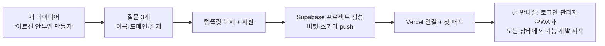

# 05 MVP 스캐폴더 (MVP Scaffolder)

> 새 아이디어가 떠오르면, 지금까지의 모든 교훈이 **처음부터 박힌** 표준 스택 뼈대를 반나절 만에 세운다.

## 해결하는 병목
- 3개월간 레포 11개 — 매번 Next+Supabase+인증+결제를 재세팅
- 같은 함정을 새 프로젝트에서 재답습할 위험 (커넥션 모드, 도메인 불일치, 스키마 드리프트…)

## 내장할 교훈 (바른발음에서 피 흘려 배운 것)

| 교훈 | 스캐폴드에 박히는 형태 |
|------|------------------------|
| Supabase 세션 모드 15개 한도 → 전면 장애 | DATABASE_URL 기본값을 트랜잭션 풀러(6543)+`PG_POOL_MAX`로, README에 경고 |
| vercel.app에서 로그인 시작 → PKCE 유실 | 정식 도메인 통일 미들웨어 기본 포함 |
| OAuth 콜백 중 DB 콜드스타트 → 첫 로그인 실패 | 어댑터 재시도 + 로그인 화면 킵얼라이브 기본 포함 |
| 스키마 드리프트 3연발 | db-guard 스크립트 + CI 스텝 기본 포함 |
| 관리자를 dev 버튼으로 만들었다 철거 | isAdmin(이메일 목록) 게이트 + /admin 뼈대 기본 포함 |
| 약관 동의·환불 고지 뒤늦게 추가 | /consent, 환불 고지 컴포넌트 기본 포함 |
| PWA 설치/전체화면/세이프에어리어 시행착오 | manifest+뷰포트+세이프에어리어 프리셋 |
| 결제 검증 가격 불일치(4900 vs 5000) | 가격 단일 소스(billing.ts) 패턴 강제 |

## 스캐폴드 구성
```
create-app.md (스킬)  →  질문 3개: 앱 이름 / 도메인 / 결제 유무
생성물:
├── Next.js 16 + TS + Tailwind (모바일 우선 레이아웃)
├── Prisma + Supabase (트랜잭션 풀러 프리셋) + db-guard
├── NextAuth 5 (카카오·구글·credentials + 재시도 + 게스트 모드 옵션)
├── /admin 뼈대 (isAdmin 게이트 + 브리핑 API 스텁)
├── Toss 단건결제 모듈 (옵션)
├── PWA 프리셋 + 웹푸시 + Vercel 크론 스텁
└── .claude/ (배포 파수꾼 루틴, kid-ux/code-review 연결)
```

## 동작 흐름



## 구현 방법
1. **1단계**: 바른발음에서 범용 부분을 추출해 `app-template` 레포로 (도메인 로직 제거, 교훈 프리셋 유지).
2. **2단계**: Claude Code 스킬 `create-app` — 질문 → 복제 → 치환 → 인프라 셋업 체크리스트 실행.
3. **3단계**: 갱신 루프 — 운영 중 새 교훈이 생기면 템플릿에도 반영 (예: "이번 사고를 템플릿에 백포트해").

## 안전장치
- 인프라 생성(Supabase 프로젝트, 도메인)은 비용 발생 — 단계마다 확인 후 진행
- 템플릿에 시크릿 절대 포함 금지 — `.env.example`만
