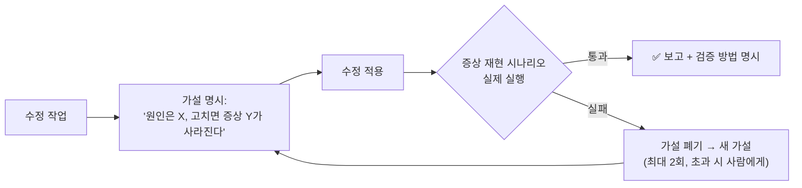
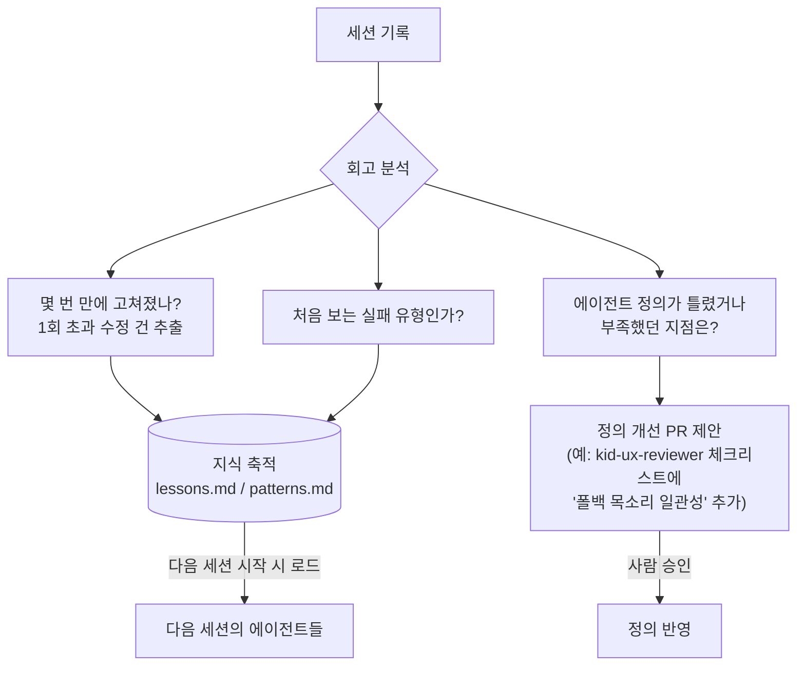

# 06 헤르메스 (Hermes) — 자가검증·자가개선 에이전트

> 일을 끝냈다고 보고하기 전에 **스스로 검증**하고, 실패에서 배운 것을 **지식으로 축적**하며,
> 그 지식으로 **다른 에이전트들의 정의 자체를 개선**하는 메타 에이전트.

## 해결하는 병목
- "수정했다"고 보고했지만 실제로는 안 고쳐진 경우 — 문장 소리 잔류 버그는 **3번의 수정**을 거쳤다
  (재생 중 정지 → 합성 대기 취소 → 폴백 60ms 레이스). 첫 수정 후 자가검증이 있었다면 1~2회차에 잡혔다.
- 같은 실수의 반복 — 스키마 드리프트 3연발, 스쿼시 머지 함정 등은 "배운 교훈"이 어디에도 기록되지 않아 재발
- 에이전트 정의(.claude/agents/*.md)가 한 번 쓰고 방치됨 — 현장에서 배운 것이 정의에 반영 안 됨

## 두 개의 루프

### 루프 A — 자가검증 (작업 단위, 즉시)
"고쳤다"의 기준을 **증상 재현 시나리오 통과**로 강제한다.



핵심 규칙:
- **검증 없이 "완료" 금지** — 검증 불가능하면 "코드상 수정, 실기기 확인 필요"로 구분해 보고
- 같은 증상에 대한 수정이 **2회 실패하면 확전 중단** — 지금까지의 가설·반증을 정리해 사람에게
- 검증은 증상이 났던 경로 그대로 (문장 카드에서 빠르게 넘기기 → 소리 확인)

### 루프 B — 자가개선 (세션 단위, 회고)
세션이 끝날 때(또는 "/retro" 호출 시) 이번 세션을 되돌아보고 지식을 축적한다.



## 지식 저장소 구조
```
agents-blueprint/knowledge/
├── lessons.md     # 교훈: 한 줄 원칙 + 근거 사례 링크 (예: "TTS 수정은 폴백 경로까지 3계층 모두 확인")
├── patterns.md    # 실패 패턴: 증상 → 원인 → 검증법 (kid-ux-reviewer 등이 리뷰 시 로드)
└── metrics.md     # 자가개선 측정: 수정 반복 횟수 추이, 재발 건수 (개선이 실제 효과 있는지)
```

## 안전장치 (자가개선의 폭주 방지)
| 위험 | 장치 |
|------|------|
| 자기 정의를 잘못 고쳐 성능 저하 | 정의 수정은 **반드시 PR로 제안**, 사람 머지 후 반영. 직접 수정 금지 |
| 검증 루프 무한 반복 | 가설-수정 사이클 **최대 2회**, 초과 시 사람 에스컬레이션 |
| 교훈의 무한 증식(프롬프트 비대) | lessons/patterns는 각 30줄 상한 — 추가하려면 덜 중요한 것 삭제(우선순위 강제) |
| 잘못된 교훈 축적 | 각 교훈에 근거 사례(PR/커밋 링크) 필수 — 근거 없는 일반화 금지 |

## 구현 방법
1. **1단계 (즉시)**: `/retro` 스킬 — 세션 회고 → lessons/patterns 갱신 제안 + 정의 개선 PR 초안. (`.claude/skills/retro/`)
2. **2단계**: 자가검증 규칙을 CLAUDE.md에 명문화 — "버그 수정 완료 보고 전 증상 재현 시나리오 실행" 원칙.
3. **3단계**: 주기 실행 — 주 1회 크론으로 최근 세션·PR을 회고해 개선 PR 자동 제안.

## 이름의 의미
전령의 신 헤르메스처럼 — 에이전트들 사이를 오가며 현장의 배움을 정의(설계)로 되돌려 보내는 역할.
