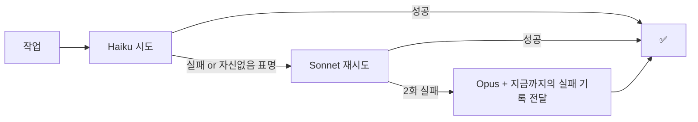

# 07 모델 라우터 (Model Router) — 업무 강도별 모델 분배로 토큰 절약

> 모든 일을 최상위 모델로 하면 비싸고, 모든 일을 최소 모델로 하면 틀린다.
> **업무 강도에 맞는 모델**(Opus / Sonnet / Haiku)을 서브에이전트별로 분배해 품질은 유지하고 비용을 낮춘다.

## 원칙: "판단의 밀도"로 분배한다
토큰량이 아니라 **한 토큰당 요구되는 판단의 난이도**가 기준이다.
같은 1만 토큰이라도 로그 수집은 Haiku로 충분하고, 원인 미상 디버깅은 Opus가 싸게 먹힌다
(싼 모델이 2번 틀리면 비싼 모델 1번보다 비싸다 — 실제로 문장 소리 버그는 3회 수정이 들었다).

## 3계층 분배표

| 계층 | 모델 | 업무 유형 | 실제 예시 (이 프로젝트) |
|------|------|-----------|--------------------------|
| 🔩 기계적 | **Haiku** | 정해진 절차의 실행·수집. 판단 거의 없음 | 배포 폴링·스모크 테스트(01), 로그 수집, 파일/문자열 탐색, 대량 배치(이미지 1736장 존재 확인), 형식 변환 |
| 🔧 표준 | **Sonnet** | 명확한 스펙의 구현·요약·1차 리뷰 | UI 수정(색·간격·문구), 명세가 확실한 기능 구현, 운영 브리핑 요약(03), PR 1차 리뷰, 문서 작성 |
| 🧠 고난도 | **Opus** | 원인 미상·설계·보안·자가개선 판단 | "왜 첫 로그인만 실패하나"류 디버깅, 아키텍처 결정(심사 흐름 설계), 스쿼시 머지 함정 같은 비직관 문제, 헤르메스(06)의 정의 개선 판단, 보안 검토 |

## 에스컬레이션 규칙 (라우팅이 틀렸을 때)


- 하위 모델 실패 시 **실패 내용을 상위 모델에 전달** — 같은 탐색을 반복하지 않게
- 반대 방향도: Opus가 "이건 기계적 반복"이라 판단하면 하위에 위임 (예: 원인 파악은 Opus, 20개 파일 일괄 치환은 Haiku)

## 기존 에이전트별 기본 모델

| 에이전트 | 기본 모델 | 근거 |
|----------|-----------|------|
| 01 배포 파수꾼 | **Haiku** | curl·폴링·상태코드 비교 — 절차가 전부 정의됨. 실패 진단 단계만 Sonnet 에스컬레이션 |
| 02 DB 가드 | **Haiku** | 스키마 대조는 기계적. SQL 자동 생성 검토만 Sonnet |
| 03 운영 브리핑 | **Sonnet** | 수집은 Haiku 하위 위임, "이상 신호인가" 판단과 요약은 Sonnet |
| 04 아동 UX 리뷰어 | **Sonnet** | 체크리스트 기반 리뷰. 애매한 판정 대립 시만 Opus |
| 05 MVP 스캐폴더 | **Sonnet** | 템플릿 치환은 기계적이나 프로젝트별 조정 판단 필요 |
| 06 헤르메스 | **Opus** | 교훈 추출·정의 개선은 오판 비용이 가장 큰 메타 판단 |

## Claude Code에서의 구현 (3가지 지점)

**① 서브에이전트 정의 frontmatter** — 가장 간단, 이미 적용함:
```yaml
---
name: deploy-sentinel
model: haiku        # 이 에이전트는 항상 Haiku로 실행
---
```

**② Agent 툴 호출 시 오버라이드** — 세션 중 개별 판단:
```
Agent(subagent_type: "deploy-sentinel", model: "sonnet")  # 이번만 상향
```

**③ Workflow 스크립트의 단계별 분배** — 대량 파이프라인에서 효과 최대:
```js
// 예: 이미지 QA 파이프라인 (1736장)
pipeline(images,
  img => agent(`존재/크기 확인: ${img}`, { model: "haiku" }),     // 기계적 검사
  r   => agent(`이미지 품질 판정: ${r}`,  { model: "sonnet" }),    // 시각 판단
)
// 최종 애매 판정 재심만: { model: "opus", effort: "high" }
```

## 비용 감각 (대략)
Haiku는 Sonnet의 약 1/3~1/4, Sonnet은 Opus의 약 1/5 비용. 대량 배치(수백~수천 호출)의
계층을 한 단계만 낮춰도 그 파이프라인 비용이 수 배 줄어든다. 반대로 **디버깅·설계는 절대 낮추지 않는다**
— 재작업 비용(사람 시간 포함)이 모델 비용을 압도한다.

## 안전장치
- 라우팅 실패 기록은 헤르메스(06)의 patterns.md로 — "이 유형은 Haiku가 계속 실패" → 분배표 갱신 제안
- 보안·결제·데이터 삭제 관련 판단은 계층 무관 **항상 Opus 이상** (비용 절약 대상 제외)
