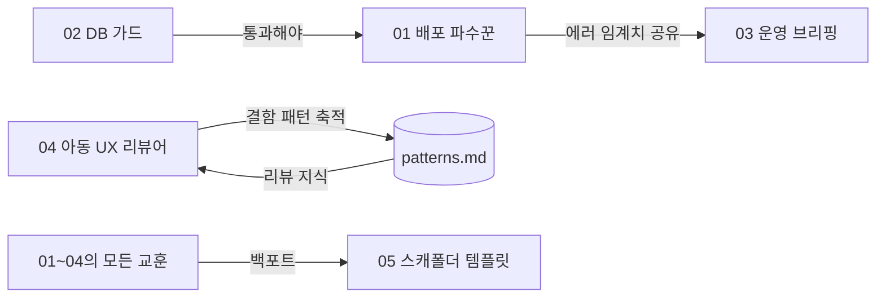

# 통합 지도 — 기존 프로젝트와의 연결 지점

## 바른발음 (Bareun-Bareum) 에 이미 존재해서 재사용할 것

| 기존 자산 | 사용하는 에이전트 |
|-----------|-------------------|
| `CRON_SECRET` + Vercel 크론 패턴 (`/api/cron/*`) | 01, 03 |
| 관리자 게이트 `src/lib/admin-auth.ts` (isAdmin) | 03 (브리핑 API) |
| 테스트 계정 admin2(무료)/admin3(유료+관리자) | 01 (스모크 로그인), 04 (등급별 화면 점검) |
| `/api/health` DB 워밍업 엔드포인트 | 01 (스모크 항목) |
| 웹푸시 인프라 (PushSubscription, VAPID) | 01, 03 의 보고 채널 (CCR 푸시 대안) |
| `/api/admin/reviews` (후기 심사) | 03 (심사 대기·마감 임박 집계) |
| Gemini QA 파이프라인 (이미지 1736장 100% 검증 경험) | 04 의 "AI 판정" 패턴 참고 |

## 에이전트 간 연결

## 다른 레포로의 확장

| 레포 | 적용 가능 에이전트 |
|------|---------------------|
| flower / ROOT_RESTRANT (로컬 비즈 사이트) | 01(배포 검증), 05(템플릿의 원형 소재) |
| Go_dok (안부/안전 앱 재개 시) | 05로 재스캐폴드 → 01·02·03 그대로 |
| workSpace (칸반) | 03의 브리핑을 카드로 흘려넣는 연동 후보 |

## 시크릿/권한 정리 (에이전트 운영 전 1회)

- [ ] 에이전트 전용 GitHub 토큰 범위 결정 (현재 CCR은 sori 한정 — dev-agents 레포 추가 필요)
- [ ] Vercel 로그 조회용 접근 (MCP 또는 토큰)
- [ ] Supabase 읽기 전용 역할 (db-guard 는 information_schema 조회만)
- [ ] 스모크용 테스트 계정 비밀번호를 강한 값으로 교체 + 시크릿 보관
